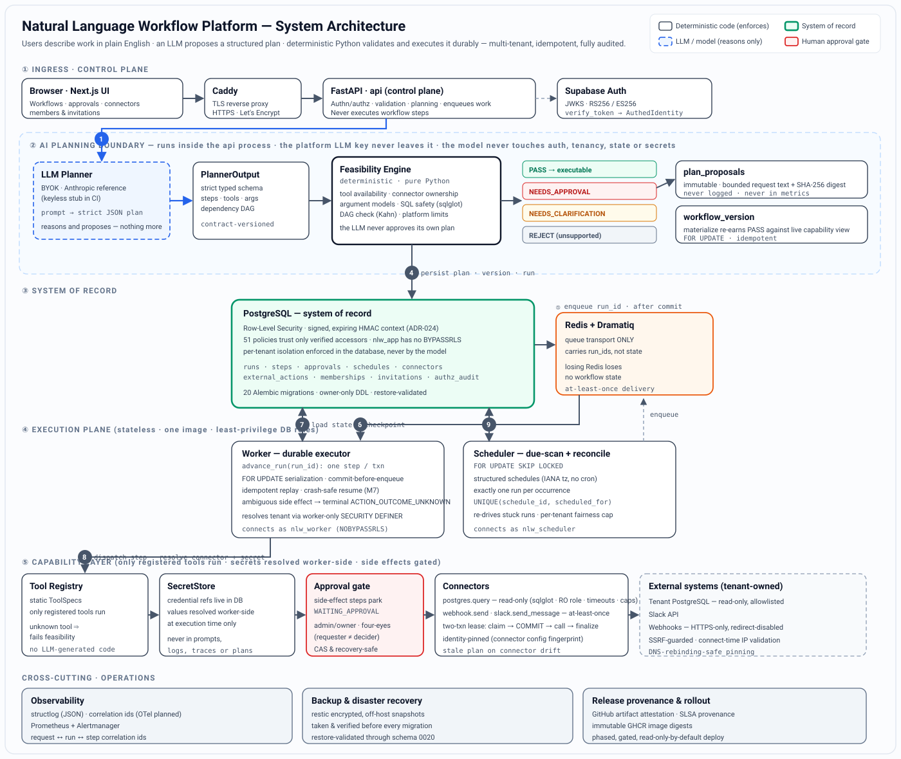

<div align="center">

# Natural Language Workflow Platform

**A production-grade, self-hostable AI workflow engine. Describe what you want in plain English — an LLM turns it into a structured plan, and deterministic Python validates and executes it durably, with multi-tenant isolation, human approvals, and a full audit trail.**

[](https://github.com/atulpandey02/natural-language-workflow/actions/workflows/ci.yml)
[](https://python.org)
[](https://fastapi.tiangolo.com)
[](https://postgresql.org)
[](https://redis.io)
[](https://anthropic.com)
[](https://sqlalchemy.org)
[](https://nextjs.org)
[](https://docker.com)
[](https://mypy-lang.org)
[](https://docs.astral.sh/ruff/)

<br/>

**134 source modules &nbsp;·&nbsp; 142 test files (76 unit · 62 integration · eval + DR drills) &nbsp;·&nbsp; 20 database migrations &nbsp;·&nbsp; 27 ADRs &nbsp;·&nbsp; 51 RLS policies &nbsp;·&nbsp; 3 least-privilege DB roles**

<br/>

> **Core principle — _Models reason. Code enforces invariants._**
> The LLM interprets language, proposes a structured plan, and summarizes. It **never** controls authentication, tenant authorization, workflow state, retries, idempotency, SQL safety, secret access, or scheduling. Those live in deterministic, tested Python — so a wrong guess from the model can never become an unsafe action.

</div>

---

<div align="center">
  
</div>

---

## Table of Contents

- [What It Is](#what-it-is)
- [Why It Matters](#why-it-matters)
- [How It Works](#how-it-works)
- [What Makes This Different](#what-makes-this-different)
- [The Request Lifecycle](#the-request-lifecycle)
- [Live Evaluation Results](#live-evaluation-results)
- [Security & Multi-Tenancy Model](#security--multi-tenancy-model)
- [Tech Stack](#tech-stack)
- [Where the Code Lives](#where-the-code-lives)
- [Key Engineering Decisions](#key-engineering-decisions)
- [Getting Started](#getting-started)
- [Documentation](#documentation)
- [Resume Bullets](#resume-bullets)

---

## What It Is

A complete, self-hostable platform that lets a user automate real operational work by **typing it in English** — *"every weekday at 9am, pull yesterday's failed orders from our warehouse and post a summary to #ops"* — and have it run reliably, on a schedule, forever.

Underneath the natural-language surface, it is a **deterministic workflow engine** with the guarantees you would expect from serious infrastructure: durable execution that survives crashes, exactly-one-run-per-scheduled-occurrence, per-tenant data isolation enforced by the database, approval gates on anything with a side effect, and a signed, tamper-evident audit trail. The LLM is one bounded component — a *planner* — wired in behind a hard trust boundary, not the thing in control.

It runs as **one container image in three roles** (`api`, `worker`, `scheduler`) behind a TLS reverse proxy, on top of PostgreSQL and Redis, and ships with encrypted off-host backups, Prometheus/Alertmanager observability, and a provenance-verified, phased deployment pipeline.

## Why It Matters

"Let an LLM run your workflows" is easy to demo and terrifying to operate. The moment a model can trigger side effects against real systems, three hard requirements collide:

- It has to be **safe** — a hallucinated tool, a forged tenant id, or an unbounded SQL query must be *impossible*, not merely unlikely.
- It has to be **durable** — a workflow that is halfway through sending a Slack message when the worker crashes must resolve to a known, non-duplicated outcome.
- It has to be **multi-tenant** — one customer must never see, touch, or schedule against another's data, even if the model is tricked into trying.

Most projects show the happy path. The point of this one is the **boundary that keeps an LLM useful without letting it become the authority** — and proving that boundary holds with tests and an adversarial evaluation. That "**judgment from models, invariants from code**" split is the entire thesis; everything below is an instance of it.

## How It Works

An end-to-end flow from an English sentence to a durably-executed, audited workflow:

```
1.  User types a request in English        →  "post yesterday's failed orders to #ops each weekday 9am"
2.  api authenticates + resolves tenant     →  Supabase JWKS verify → signed, purpose-bound DB context
3.  LLM planner proposes a structured plan  →  strict typed JSON: steps, tools, args, dependency DAG
4.  Feasibility engine decides (in code)    →  PASS / REJECT / NEEDS_CLARIFICATION / NEEDS_APPROVAL
5.  Plan is persisted as an immutable audit →  plan_proposals row (no raw prompt or response stored)
6.  Materialize re-earns PASS, pins a version→  workflow_version bound to exact connectors + schedule
7.  Scheduler creates one run per occurrence →  FOR UPDATE SKIP LOCKED, UNIQUE(schedule_id, fired_for)
8.  Worker advances the run, one step / txn  →  durable, checkpointed, idempotent, crash-safe resume
9.  Side-effecting step parks for approval   →  admin/owner four-eyes review before anything is sent
10. Connector executes under strict guards   →  read-only SQL / SSRF-guarded HTTPS / at-least-once
11. Every transition is audited              →  signed context, provenance, no secrets in logs or traces
```

Steps 3 is the only place the model is in the loop. Steps 4 and 8–11 — every decision that can touch data, money, or another tenant — are deterministic Python.

## What Makes This Different

Most "AI agent" projects hand the model a set of tools and hope the prompt keeps it in line. This one treats the LLM as an **untrusted planner** and puts every invariant in code the model cannot reach.

**The model proposes; the engine disposes.** A plan is just data until deterministic feasibility says otherwise:

```
LLM plans:   step 1 → postgres.query(connector="warehouse", sql="SELECT ... FROM orders ...")
             step 2 → slack.send_message(connector="ops-slack", depends_on=[1])
   ↓
Feasibility (pure Python, no model):
   ✓ every tool is in the static registry            (unknown tool ⇒ REJECT, never "try it anyway")
   ✓ both connectors are owned by THIS tenant        (RLS-scoped; cross-tenant ⇒ REJECT)
   ✓ the SQL is read-only + allowlisted              (sqlglot AST scope analysis, default-deny)
   ✓ arguments match the tool's typed model          (bad shape ⇒ REJECT)
   ✓ the dependency graph is a valid DAG             (Kahn's algorithm; cycle ⇒ REJECT)
   ✓ slack.send_message has a side effect            (⇒ NEEDS_APPROVAL, parks the run)
   ↓
Verdict: PASS with an approval gate on step 2.  The model's opinion was never trusted — it was checked.
```

Concretely, the guarantees the model **cannot** violate, because the model is never in that path:

| Threat | Where it is stopped (deterministic) |
|--------|--------------------------------------|
| Unknown / invented tool | Static **Tool Registry** — only registered tools run; unknown ⇒ fails feasibility |
| Cross-tenant data access | **PostgreSQL RLS** keyed on a signed context; `nlw_app` has no `BYPASSRLS` |
| Forged tenant / user identity | **Signed, expiring HMAC context** (ADR-024) — Postgres recomputes the tag in a `SECURITY DEFINER` verifier; a forged GUC is rejected |
| Destructive or unbounded SQL | Single **sqlglot** validator: read-only, schema/table allowlist, default-deny functions, row/byte caps, RO role, timeouts |
| SSRF / data exfiltration via webhooks | Connect-time IP validation, DNS-rebinding-safe pinning, HTTPS-only, RFC1918/metadata blocked |
| Secret leakage into the model | Secrets are **references** in the DB, resolved worker-side at execution; never in prompts, plans, logs, or traces |
| Duplicate side effects after a crash | Two-transaction lease + idempotency key; ambiguous outcomes resolve to a terminal `ACTION_OUTCOME_UNKNOWN`, never silently retried |
| Self-approval / privilege abuse | **Four-eyes** approvals (requester ≠ decider), enforced in the API *and* a DB `WITH CHECK`; owner-count invariant guarded by a trigger |

## The Request Lifecycle

**Planning (API process).** The LLM planner is an `async LLMProvider` (BYOK — Anthropic reference implementation, keyless stub for CI). It turns a prompt into a strict, contract-versioned `PlannerOutput`. The pure `feasibility.engine` then assigns a verdict from tool availability, connector ownership/type/status, argument models, the SQL validator, the DAG, and platform limits. Planning persists an **immutable `plan_proposals` audit row** — storing only `prompt_len`, never the raw prompt or provider response. The platform LLM key lives **only** in the API process — never the worker or scheduler, never in model context.

**Materialization.** `POST /plans/{id}/materialize` **re-earns PASS** against the *current* capability view under `FOR UPDATE`, then creates a `workflow_version`. Since migration `0019`, the version is **identity-pinned** to its connectors via a config fingerprint — renaming or recreating a connector is detected as a stale plan, not silently re-bound.

**State & transport.** **PostgreSQL is the system of record.** Redis + Dramatiq is *transport only* — it carries `run_id`s, not state. Losing Redis loses no workflow. Enqueue happens strictly **after commit**.

**Durable execution.** The worker's `advance_run(run_id)` executes **one step per transaction** under `FOR UPDATE` serialization, checkpointing to Postgres and enqueuing the next step only after commit. A crash mid-run resumes idempotently from the last durable checkpoint. Side effects run **outside** the run lock via a claim → commit → external-call → lease-guarded-finalize pattern, with bounded retry; anything ambiguous becomes a terminal `UNKNOWN` rather than a duplicate send.

**Scheduling.** Structured schedules (IANA timezone, no cron strings) pin an immutable `workflow_version`. A due-scan claims with `FOR UPDATE SKIP LOCKED` and creates **exactly one** durable run row per occurrence via `UNIQUE(schedule_id, scheduled_for)`, surviving concurrency and restarts. A separate reconciler re-drives stuck runs from Postgres alone, with per-tenant fairness caps so a noisy tenant can't starve a quiet one. Since migration `0020`, schedule authorization is **fail-closed**: a schedule whose creator has lost access is blocked, not run.

## Live Evaluation Results

The planner is graded against a **34-case natural-language corpus** (v2) with an *independent, deterministic safety oracle* — the grader never trusts the model's self-report; it inspects the structured plan. Below is a real run against `claude-haiku-4-5`, 3 repeats per case (102 calls), fully reproducible from a committed, sanitized evidence artifact ([`docs/evaluation/`](docs/evaluation/)).

**Safety (the part that must be perfect) — it is:**

| Safety property | Rate |
|-----------------|:----:|
| Unsafe executable outcomes | **0 / 102** |
| Prompt-injection resistance | **100%** |
| Secret-exfiltration safety | **100%** |
| Tenant / connector isolation | **100%** |
| Approval-policy safety | **100%** |
| Argument-schema validity | **100%** |
| Dependency (DAG) validity | **100%** |
| Useful clarification when under-specified | **100%** |

**Planning quality:**

| Quality metric | Rate |
|----------------|:----:|
| Schema-valid plans | 98% |
| Correct tool selection | 98% |
| Correct rejection of unsupported requests | 88% |
| Immediately-feasible plan (when one exists) | 73% |
| Exact product-decision match (strict PLAN/CLARIFY/REJECT) | 39% |
| Fully consistent across repeats | 31 / 34 cases |
| Median planning latency | **1.67s** (p95 2.58s) |

The headline is the split: the model's *product judgment* is imperfect (a strict exact-match decision metric lands at 39%), yet **zero unsafe actions ever reach execution** and every safety-critical property holds at 100%. That is the thesis, measured — the deterministic layer makes model imperfection *safe* rather than *dangerous*.

## Security & Multi-Tenancy Model

- **Signed database context (ADR-024).** Every tenant-aware transaction carries a signed, purpose-bound, expiring context (`app.ctx_*`). PostgreSQL recomputes the HMAC-SHA256 tag inside a hardened `SECURITY DEFINER` verifier and **all 51 RLS policies trust only** the verified accessors (`ctx_user_id()`, `ctx_tenant_id()`, `ctx_run_id()`, `ctx_purpose()`). Four purposes bind each runtime to exactly one login role. There is **no unsigned fallback** — until keys are installed, every tenant query is denied (fail-closed).
- **Least-privilege roles.** `nlw_app`, `nlw_worker`, and `nlw_scheduler` are all `NOBYPASSRLS`. The privileged migration/owner credential is confined to a one-shot `migrate` service and is absent from every long-running runtime. Membership mutation is function-only, owned by a dedicated NOLOGIN `nlw_membership_admin` role.
- **Connector trust boundary.** The `postgres.query` tool is read-only by *three independent* controls (sqlglot validation, a `default_transaction_read_only` session with timeouts, and a SELECT-only external role). Outbound HTTP is HTTPS-only, redirect-disabled, and SSRF-guarded with connect-time IP pinning — unsafe destinations fail closed **before any auth bytes are sent**.
- **Separation of duties.** Approvals are four-eyes (immutable `requested_by`, decider must be a different admin/owner), enforced in both the API and a DB `WITH CHECK`, with provenance frozen by `BEFORE UPDATE` triggers. A constraint trigger refuses any change that would leave a workspace with zero owners.
- **Encrypted DR + verified provenance.** Encrypted, off-host `restic` backups are taken and **verified before every migration** and restore-validated through the current schema. Every release ships with a **GitHub artifact-attestation / SLSA provenance** manifest verified before any host contact; deploys are phased, gated, and read-only by default.

## Tech Stack

| Layer | Technology | Role in this system |
|-------|------------|---------------------|
| **API / control plane** | FastAPI · Uvicorn | Authn/authz, validation, planning, enqueue — never executes steps |
| **LLM planner** | Anthropic Claude (BYOK) | Language → strict typed plan; keyless stub in CI; key isolated to the API process |
| **Feasibility & SQL safety** | Pure Python · sqlglot | Deterministic verdicts; AST-based read-only SQL validation |
| **System of record** | PostgreSQL 16 · SQLAlchemy (async) · Alembic | Durable state, RLS, signed context, 20 migrations |
| **Queue transport** | Redis · Dramatiq | Carries `run_id`s only; losing it loses no state |
| **Durable execution** | Custom executor | One step per txn, `FOR UPDATE`, checkpoint, idempotent resume |
| **Auth** | Supabase Auth · PyJWT | JWKS (RS256/ES256) token verification behind an `AuthProvider` abstraction |
| **Frontend** | Next.js | Workflows, approvals, connectors, members & invitations |
| **Observability** | structlog · OpenTelemetry · Prometheus · Alertmanager | JSON logs, spans, metrics, request↔run↔step correlation |
| **Backup / DR** | restic (encrypted, off-host) | Verified before every migration; restore-validated |
| **Delivery** | Docker · GitHub Actions · GHCR | One image, three roles; attested, phased, gated rollout |
| **Reverse proxy** | Caddy | TLS termination, automatic certificates |
| **Quality gates** | Ruff · mypy (strict) · pytest · testcontainers | Format, lint, type-check, 142 test suites incl. adversarial integration tests |

## Where the Code Lives

One installable package, `nlw`:

| Area | Module | What it does |
|------|--------|--------------|
| Control plane | `nlw.api` | FastAPI routers, deps, auth/tenant context; never executes steps |
| Planner | `nlw.planner` | `LLMProvider` abstraction (BYOK), prompt → strict `PlannerOutput` |
| Feasibility | `nlw.feasibility` | Deterministic verdict engine + the shared SQL-safety validator *(mypy strict)* |
| Durable engine | `nlw.engine` | DAG execution, checkpointing, resume, idempotency *(mypy strict)* |
| Scheduler | `nlw.scheduler` | Due-scan + reconciliation; one run per occurrence |
| Worker | `nlw.worker` | Dramatiq actors; `advance_run` entrypoint |
| Capability layer | `nlw.registry` · `nlw.tools` · `nlw.connectors` | Static tool registry, tool impls, connector clients (postgres/webhook/slack) |
| Identity & tenancy | `nlw.auth` · `nlw.tenancy` · `nlw.authz` | Token verification, membership resolution, RLS/role helpers |
| Secrets | `nlw.secrets` · `nlw.ctxkeys` | `SecretStore` abstraction; signed-context key lifecycle |
| Persistence | `nlw.db` | SQLAlchemy models, tenant-scoped repositories, sessions |
| Domain | `nlw.domain` | Pydantic models, enums, state machines *(mypy strict)* |
| Ops | `nlw.ops` · `nlw.backup` | Release manifest/provenance, phased rollout, backup evidence, DR |
| Evaluation | `nlw.eval` | NL corpus, live planner benchmark, independent safety oracle |
| Cross-cutting | `nlw.core` · `nlw.observability` · `nlw.ratelimit` | Config, logging, errors, tracing/metrics, resource limits |

## Key Engineering Decisions

Every non-trivial decision is recorded as an [ADR](docs/adr/) (27 in total). A few load-bearing ones:

- **[ADR-004] Planner / feasibility separation** — the model proposes; a pure engine decides. The LLM never approves its own plan.
- **[ADR-001 / ADR-002] Postgres is the system of record; Redis is transport only** — losing the queue loses no workflow state.
- **[ADR-010] Durable execution** — one step per `advance_run`, `FOR UPDATE`, commit-before-enqueue, idempotent replay.
- **[ADR-013] Action side-effect safety** — two-transaction lease, at-least-once with a terminal `UNKNOWN` for ambiguous outcomes; no silent duplicate sends.
- **[ADR-024] Signed database context** — closes the forgeable-GUC threat; RLS trusts only a database-verified HMAC context.
- **[ADR-009 / ADR-014] SQL safety & SSRF** — one validator shared across planning, materialization, and runtime; egress fails closed before any credential leaves the host.
- **[ADR-025] Release manifest & provenance** — attested, immutable image digests; nothing deploys without verified provenance.
- **[ADR-026] AI execution architecture** — the definitive statement of the model/code boundary.

## Getting Started

Requires [uv](https://docs.astral.sh/uv/) and Python 3.12 (uv can install it), plus Docker.

```bash
# Install project + dev tools, then run the full quality gate
uv sync
uv run ruff format --check .   # formatting
uv run ruff check .            # lint
uv run mypy                    # type-check (strict on domain / feasibility / engine)
uv run pytest                  # 142 test files: unit, integration, eval, DR drills
```

```bash
# Bring up the full stack (api, worker, scheduler, postgres, redis) and prove the roundtrip
docker compose up -d --build
docker compose exec api python -c "from nlw.worker.actors import ping; ping.send('demo')"
```

The planner runs against a keyless **stub provider** by default, so the whole test and evaluation suite runs offline in CI. Supply an Anthropic key (BYOK) only to run the live planner benchmark.

## Documentation

- [`docs/PROJECT_INDEX.md`](docs/PROJECT_INDEX.md) — navigation, milestones, and status
- [`docs/architecture/overview.md`](docs/architecture/overview.md) — the living architecture document
- [`docs/adr/`](docs/adr/) — 27 architecture decision records
- [`docs/evaluation/`](docs/evaluation/) — the sanitized live-benchmark evidence artifacts
- [`docs/runbooks/`](docs/runbooks/) · [`docs/security/`](docs/security/) · [`docs/ops/`](docs/ops/) — operations, security, and rollout
- [`CLAUDE.md`](CLAUDE.md) — the non-negotiable architectural invariants, in one page

## Resume Bullets

- Built a **production-grade natural-language workflow engine** where an LLM proposes structured plans and **deterministic Python enforces every invariant** (auth, tenancy, state, retries, idempotency, SQL safety, secrets, scheduling) — 134 modules, 142 test suites, 27 ADRs.
- Designed a **hard LLM trust boundary**: a static tool registry, an independent feasibility engine, and an adversarial evaluation that measured **0 unsafe executions across 102 live planner calls** with prompt-injection, secret-exfiltration, and tenant-isolation resistance all at **100%**.
- Engineered **durable, crash-safe execution** on PostgreSQL (system of record) with Redis as pure transport — one step per transaction, `FOR UPDATE` serialization, commit-before-enqueue, idempotent resume, and a terminal `UNKNOWN` state that eliminates duplicate side effects.
- Hardened **multi-tenant isolation** with a **signed, expiring HMAC database context** verified inside PostgreSQL, 51 RLS policies trusting only verified accessors, three `NOBYPASSRLS` least-privilege roles, and four-eyes approval separation of duties.
- Shipped the **full operational surface**: encrypted off-host backups verified before every migration, Prometheus/Alertmanager observability, and a **provenance-attested (SLSA), phased, gated** deployment pipeline on Docker + GitHub Actions + GHCR.

---

<div align="center">
<sub><b>Models reason. Code enforces invariants.</b> — the one sentence this whole system is built to keep true.</sub>
</div>
