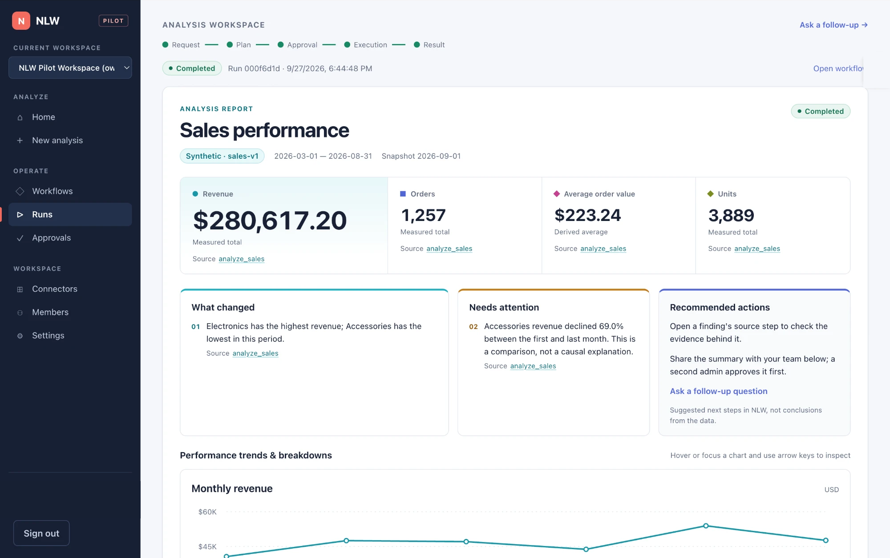
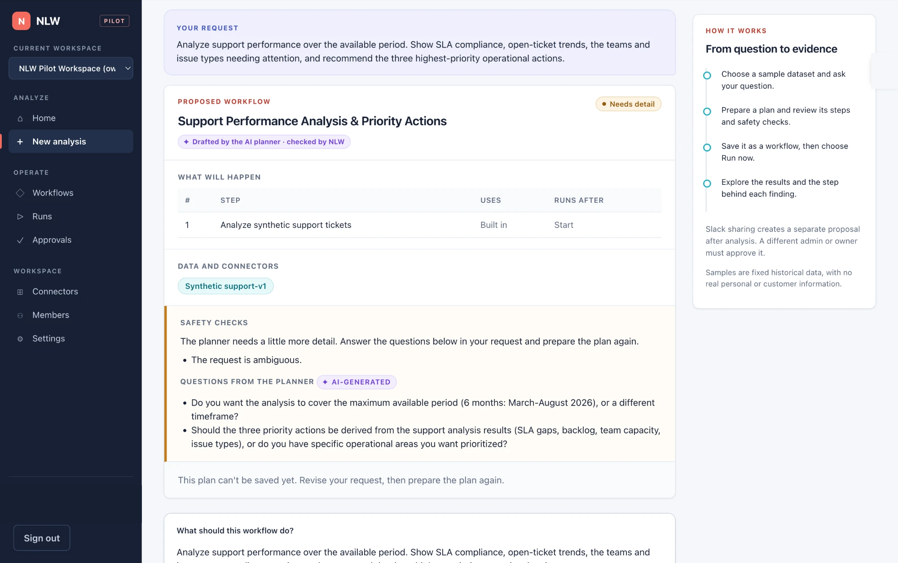
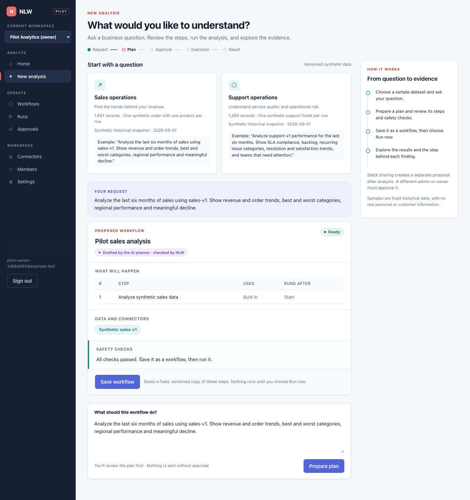
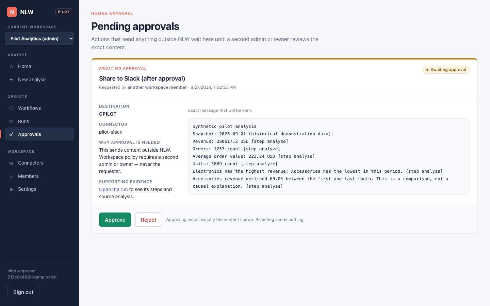
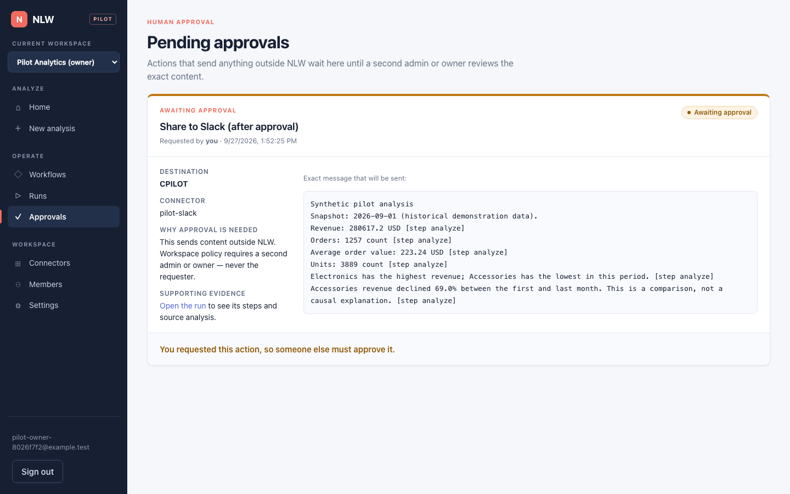
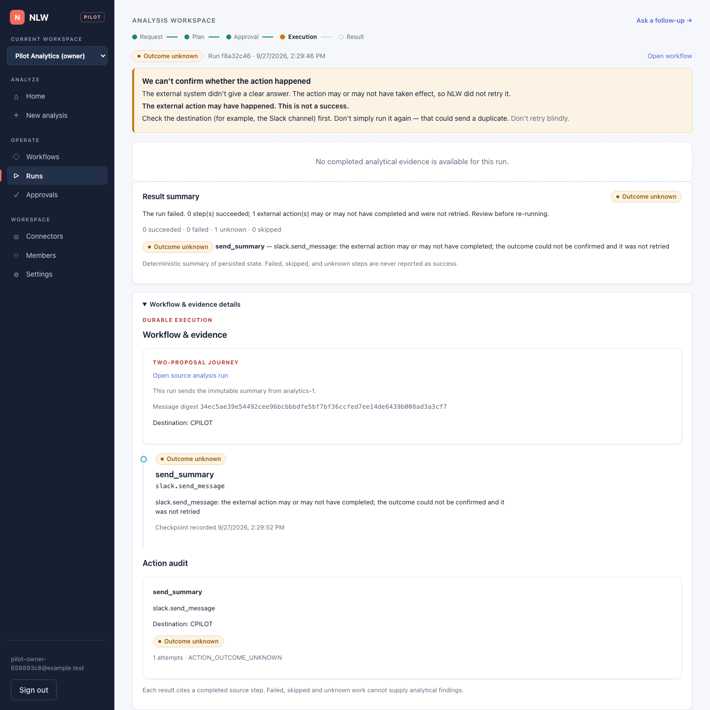
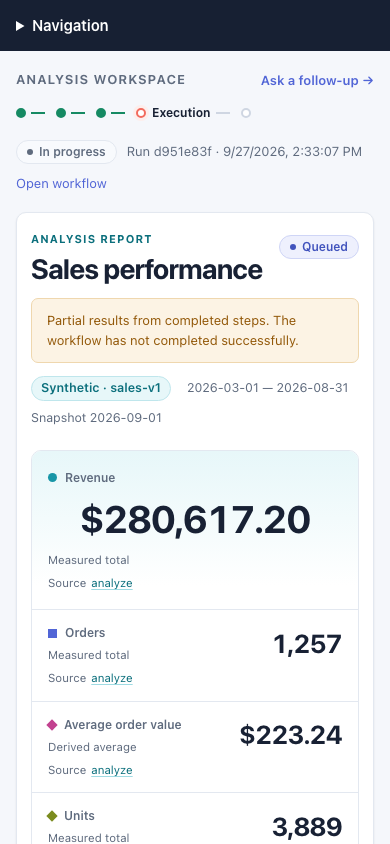
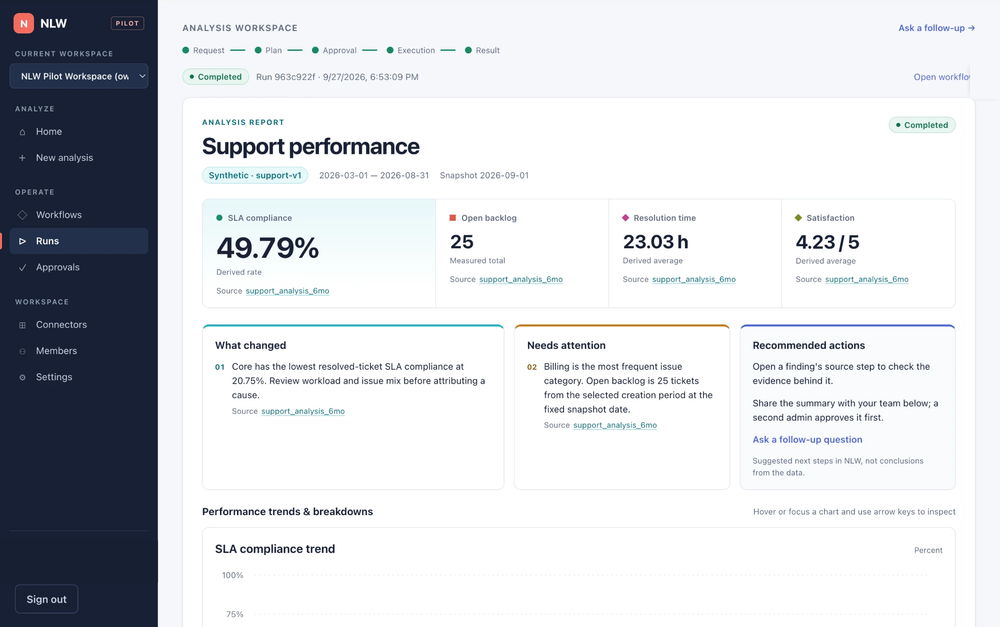
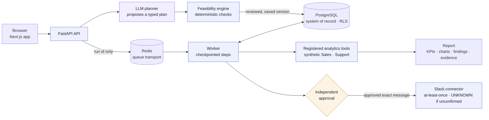

# Natural Language Workflow (NLW)

**Ask a business question in plain English, review the workflow NLW proposes, run it on governed data, and share the grounded result only after a second person approves the exact message.**

[](https://github.com/atulpandey02/natural-language-workflow/actions/workflows/ci.yml)
[](https://github.com/atulpandey02/natural-language-workflow/actions/workflows/e2e.yml)

**[Live pilot](https://app.nlwplatform.com)** (invitation-only) · **[Demo video](https://drive.google.com/file/d/1PiC-y1g_NARMfrF-oL4t-_q1dDAH7jO5/view?usp=sharing)** · [Architecture](#architecture) · [Validation evidence](#validation-evidence)

> **Controlled pilot.** NLW runs as a production-style staging deployment on AWS with two synthetic, fixed-snapshot datasets. It is not a production service for real customer data, and there is no public sign-up.

<p align="center">
  
</p>

## What NLW does

1. **Plan in natural language.** A language model turns the question into a *proposed* workflow: typed steps, registered tools and dependencies. The proposal is data, not code.
2. **Check deterministically.** A pure-Python feasibility engine accepts, rejects or asks for clarification. The model never approves its own plan, never runs code, and never sees credentials.
3. **Execute durably.** A worker runs the saved workflow one checkpointed step at a time, with PostgreSQL as the system of record.
4. **Show grounded evidence.** Results appear as KPIs, charts, tables and findings. Each figure links back to the execution step that produced it.
5. **Approve before anything leaves NLW.** Sharing a result to Slack creates a separate proposal. An independent admin or owner must approve the exact, immutable message, and the requester cannot approve their own request.

The design rule behind all of this: **models reason; code enforces the invariants** (authentication, tenancy, permissions, state, retries, SQL safety, secret access).

## Live pilot and access

- **URL:** <https://app.nlwplatform.com> (HTTPS, custom domain).
- **Access is by invitation.** Signing in needs two things:
  1. an identity in **Supabase Auth**, and
  2. a **membership in an NLW workspace**, granted by an owner or admin through an invitation bound to that email address.

  Authentication alone grants access to no workspace data.
- **Data is synthetic.** The Sales and Support datasets are fixed historical snapshots with no real customer or personal information. Uploading your own data isn't available in the pilot.

## An end-to-end run

| Step | Who | What happens |
| --- | --- | --- |
| Ask | Requester | Types a question or picks a sample (Sales or Support). |
| Plan | Model + NLW | The planner proposes steps; the feasibility engine labels the plan *Ready*, *Needs approval*, *Needs detail* or *Blocked*. |
| Review | Requester | Sees the steps, data bindings and safety checks, then saves a fixed, versioned workflow. Nothing has run yet. |
| Execute | Worker | Runs the saved version durably; each step is checkpointed. |
| Evidence | Requester | Explores KPIs, trends, breakdowns and findings, each linked to its source step. |
| Share | Requester | Proposes posting the exact analysis summary to a Slack channel owned by the workspace. |
| Approve | A different admin/owner | Reviews the destination and the exact message, then approves or rejects. Self-approval is refused by the API and by the database. |
| Deliver | Worker | Sends the approved message and records the outcome in an audit trail. |

## Visual tour

| | |
| --- | --- |
|  **Checked, not trusted:** the planner's proposal is labelled *Needs detail* by NLW's checks; its questions are marked AI-generated, and the plan can't be saved yet. |  **Plan review:** a plan that passed its checks, shown before anything runs. |
|  **Approver view:** the exact outgoing message and destination. |  **Requester view:** self-approval is blocked. |
|  **Honest outcomes:** an unconfirmed delivery is shown as *Outcome unknown*, never as success. |  **Responsive:** tested at desktop, tablet and phone widths. |

All screenshots show synthetic data. The hero and live-pilot images come from the deployed staging pilot, with account details redacted ([`docs/evidence/live-pilot/`](docs/evidence/live-pilot/README.md)). The rest come from the automated browser harness, using synthetic `example.test` accounts ([`docs/evidence/launch-closure/visual/`](docs/evidence/launch-closure/visual/)).

## Pilot use cases

| Dataset | What the analysis covers | Example question |
| --- | --- | --- |
| **Sales operations** (one synthetic order per row, snapshot 2026-09-01) | Revenue, orders, average order value and units; monthly trends; best and worst categories; regional and product performance | *"Analyze the last six months of sales. Show revenue and order trends, best and worst categories, regional performance and meaningful decline."* |
| **Support operations** (one synthetic ticket per row, snapshot 2026-09-01) | SLA compliance, open backlog, issue categories, resolution and satisfaction trends, teams needing attention | *"Analyze support performance for the last six months. Show SLA compliance, backlog, recurring issue categories and satisfaction trends."* |

<p align="center">
  
</p>

Each report shows:
- **What changed** and **Needs attention:** the backend's grounded findings, verbatim, with source links.
- **Recommended actions:** suggested next steps inside NLW, such as checking evidence, sharing for approval or asking a follow-up. They are explicitly labelled as not being conclusions from the data.

## Architecture


```mermaid
flowchart LR
  B["Browser<br/>Next.js app"] --> API["FastAPI API"]
  API --> P["LLM planner<br/>proposes a typed plan"]
  P --> F["Feasibility engine<br/>deterministic checks"]
  F -->|"reviewed, saved version"| DB[("PostgreSQL<br/>system of record · RLS")]
  API -->|"run id only"| Q[("Redis<br/>queue transport")]
  Q --> W["Worker<br/>checkpointed steps"]
  W <--> DB
  W --> T["Registered analytics tools<br/>synthetic Sales · Support"]
  T --> R["Report<br/>KPIs · charts · findings · evidence"]
  W --> AP{"Independent<br/>approval"}
  AP -->|"approved exact message"| S["Slack connector<br/>at-least-once · UNKNOWN if unconfirmed"]

  classDef model fill:#f3eefe,stroke:#8b5cf6,color:#182134
  classDef code fill:#eef0fd,stroke:#5165d6,color:#182134
  classDef human fill:#fcf3e4,stroke:#c17a18,color:#182134
  class P model
  class API,F,W,T,S code
  class AP human
```

Violet is model output (a proposal only); blue is deterministic code; amber is a human decision. A more detailed component diagram is in [`docs/architecture/img/architecture.svg`](docs/architecture/img/architecture.svg).

| Component | Responsibility |
| --- | --- |
| **Next.js web app** | Sign-in, onboarding, plan review, analytics reports, approvals, connectors, members. Talks to the API only through a server-side proxy. |
| **FastAPI `api`** | Authentication, workspace resolution, planning and validation. It never executes workflow steps. The planner's model key exists only here. |
| **LLM planner** | Language to a strict, typed plan (Anthropic Claude; a keyless stub in CI). Its output is checked, never trusted. |
| **Feasibility engine** | Deterministic verdicts: registered tools only, workspace-owned connectors, typed arguments, read-only SQL, acyclic dependencies, approval required for side effects. |
| **PostgreSQL** | The system of record: runs, steps, approvals, actions and audit events. Row-level security isolates workspaces. |
| **Redis + Dramatiq** | Queue transport only. It carries run IDs, not state, so losing it loses no work. |
| **Worker / scheduler** | The durable executor and the schedule due-scan, the same image in different roles, each with its own least-privilege database role. |
| **Caddy** | TLS termination and automatic certificates. |

Deeper reading: [architecture overview](docs/architecture/overview.md) and the [AI execution architecture (ADR-026)](docs/adr/ADR-026-ai-execution-architecture.md).

## Approval and Slack delivery

- **Separate proposal.** Sharing is never part of the analysis run. It's a new proposal whose message is fixed from the completed analysis and bound to it by digest.
- **Four-eyes.** The approver must be a different admin or owner. This is enforced in the API and by a database check, not only hidden in the UI.
- **Credentials stay server-side.** A connector names a secret *reference*. The token itself is resolved only in the worker, only for that workspace, and never reaches the browser, the model, logs or plans.
- **Honest delivery semantics.** Slack delivery is **at-least-once**. The worker leases each send and records the result. If the outcome can't be proven, for example after a timeout, the action becomes a terminal `UNKNOWN`: it is never automatically re-sent, and the UI tells the operator to check the channel first. NLW does not claim exactly-once delivery.
- **Tested:** the full propose → approve → deliver path, including self-approval denial and the `UNKNOWN` path, runs in CI's isolated browser harness against a mock Slack transport.

## Security and reliability

In plain terms:

- **The model can't act on its own.** It only proposes. Unknown tools, cross-workspace connectors, unsafe SQL and invalid plans are rejected by code the model can't influence.
- **Workspaces are isolated in the database.** Every tenant query carries a signed, expiring context that PostgreSQL verifies itself, and 51 row-level-security policies trust only that verified context. With no valid context, queries are denied.
- **Least privilege.** The API, worker and scheduler use separate database roles without row-level-security bypass. The migration credential is confined to a one-shot migration job.
- **External calls are guarded.** SQL connectors are read-only in three independent ways. Outbound HTTP is HTTPS-only and protected against server-side request forgery.
- **Nothing ambiguous is re-sent.** Durable, idempotent execution means a crash resumes from the last checkpoint instead of repeating side effects.
- **Deployments are verified.** Releases ship as attested images with SLSA provenance, verified before any host is contacted. A phased rollout takes and verifies an encrypted off-host backup before any database change, and a final GO gate requires verified alert delivery and working public routes.
- **Recoverable.** Backups are encrypted with restic, stored off-host and restore-validated.
- **Accessible, responsive UI.** Keyboard navigation and visible focus are tested in the browser suite, text colors are checked for at least 4.5:1 contrast, motion is reduced when requested, and layouts are checked at seven widths from 390 to 1440 px.

Implementation details and threat model: [`docs/security/`](docs/security/), [ADR-024 signed database context](docs/adr/ADR-024-signed-database-context.md), [ADR-013 action side-effect safety](docs/adr/ADR-013-action-side-effect-safety.md).

## Technology

| Layer | Technology |
| --- | --- |
| Backend | Python 3.12, FastAPI, SQLAlchemy (async), Alembic, Pydantic, sqlglot |
| Execution | PostgreSQL 16 (system of record), Redis + Dramatiq (transport) |
| Model | Anthropic Claude behind a provider interface (bring your own key); stub provider for CI |
| Frontend | Next.js, React, Recharts, TanStack Query |
| Identity | Supabase Auth (JWKS verification) + NLW workspace membership |
| Operations | Docker Compose, Caddy, Prometheus, Alertmanager, restic, GitHub Actions, GHCR, artifact attestations |
| Quality | Ruff, mypy (strict on the core), pytest + testcontainers, Vitest, Playwright |

## Local development

Requires [uv](https://docs.astral.sh/uv/), Python 3.12, Node.js 22 and Docker.

```bash
uv sync
uv run ruff format --check . && uv run ruff check . && uv run mypy
uv run pytest
```

```bash
cd web
npm ci
npm run lint && npm run typecheck && npm test && npm run build
```

```bash
# Start api, worker, scheduler, web, PostgreSQL and Redis locally
docker compose up -d --build
```

The planner uses a keyless stub by default, so the test suites run offline. A model key is needed only for the live planner benchmark.

## Validation evidence

- **CI on every pull request** runs:
  - format, lint, types and unit tests;
  - integration tests against real PostgreSQL;
  - a clean-database migration run;
  - Docker image builds and scanning;
  - frontend checks and build;
  - a secret scan and dependency audit;
  - two required browser suites: a seeded-stack suite, and an isolated pilot harness covering Sales, Support, invitations, approvals and failure states.
- **Launch-closure evidence**
  ([`docs/evidence/launch-closure/`](docs/evidence/launch-closure/README.md)):
  - backend 1,793 passed / 35 opt-in skips;
  - frontend 43 files / 363 tests;
  - seeded browser suite 8 / 8;
  - pilot harness journeys all passing with none skipped;
  - token-level contrast checks;
  - responsive checks at seven widths.
- **Planner safety benchmark**
  ([`docs/evaluation/`](docs/evaluation/README.md)): 34 natural-language cases × 3 repeats against Claude Haiku 4.5, planning only.
  - 0 of 102 planner outputs led to an unsafe executable outcome;
  - prompt-injection cases 9 / 9 safe;
  - secret-exfiltration cases 3 / 3 safe;
  - tenant-isolation cases 6 / 6 safe.
  - Planning *quality* is lower than safety, for example 39 % exact product-decision match. That is expected: the deterministic layer is what makes imperfect plans safe. The evidence README explains every limitation.

## Scope and limitations

- **Pilot, not production.** It's for synthetic data and invited users, not unrestricted real customer data.
- **Fixed datasets.** Two pre-registered analyses; no arbitrary CSV upload or free-form analysis over new sources yet.
- **Invitation-only.** No self-service sign-up, password reset or billing.
- **Co-member emails aren't shown on the Members page.** Only your own email is shown; others appear by join date, pending a reviewed database change.
- **Single-host staging.** One AWS instance with verified off-host backups, not a highly available deployment.
- **Slack delivery is at-least-once** with explicit `UNKNOWN` handling. The committed evidence covers it with a mock transport; live-delivery evidence isn't yet in the repository.
- **Tracing:** structured logs and metrics exist; OpenTelemetry tracing is planned, not implemented.

## Roadmap

- Customer-provided datasets with schema validation and per-workspace data contracts.
- More governed analyses, for example staffing and capacity, and more delivery destinations.
- A reviewed co-member directory for workspace administration.
- A highly available deployment, distributed tracing and an operator dashboard.

## Documentation

| Document | Purpose |
| --- | --- |
| [`docs/architecture/overview.md`](docs/architecture/overview.md) | Living architecture document |
| [`docs/adr/`](docs/adr/) | 27 architecture decision records |
| [`docs/development/pilot-analytics.md`](docs/development/pilot-analytics.md) | Pilot datasets, metric definitions and result contract |
| [`docs/evidence/launch-closure/README.md`](docs/evidence/launch-closure/README.md) | Latest product validation evidence and screenshots |
| [`docs/evaluation/README.md`](docs/evaluation/README.md) | Planner benchmark evidence and limitations |
| [`docs/runbooks/`](docs/runbooks/) · [`docs/ops/`](docs/ops/) · [`docs/security/`](docs/security/) | Operations, rollout, recovery and security |
| [`docs/PROJECT_INDEX.md`](docs/PROJECT_INDEX.md) | Engineering history and milestone index |
| [`CLAUDE.md`](CLAUDE.md) | The non-negotiable architectural invariants on one page |
