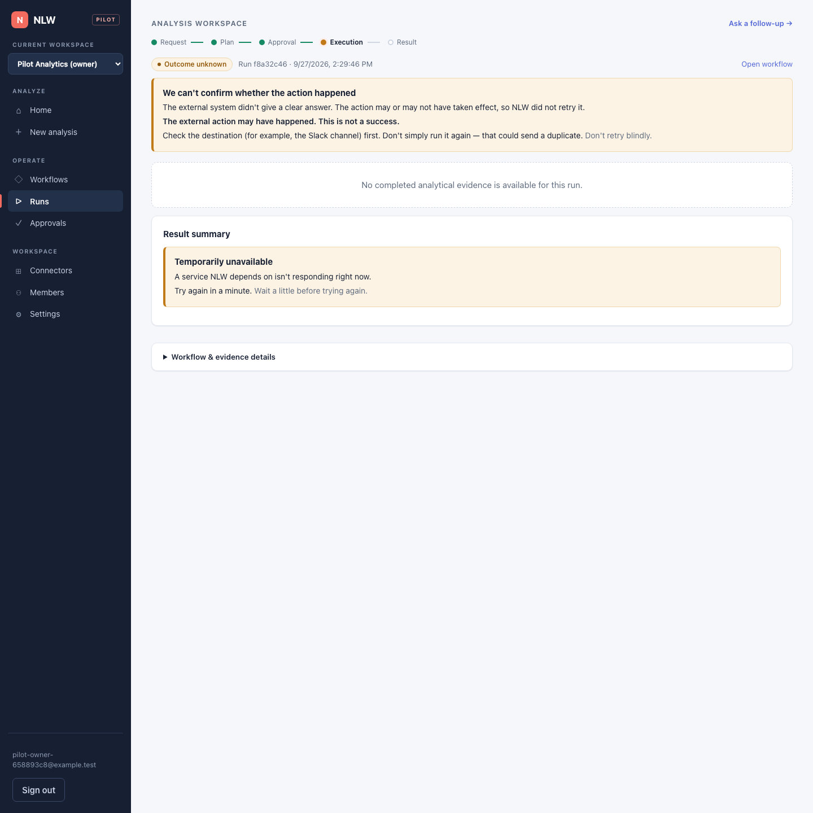

# Natural Language Workflow (NLW)

NLW turns a business question in plain English into a reviewed, versioned workflow. It runs that workflow on governed data, and shares the result only after a second person approves the exact message.

[](https://github.com/atulpandey02/natural-language-workflow/actions/workflows/ci.yml) [](https://github.com/atulpandey02/natural-language-workflow/actions/workflows/e2e.yml)

**[Live pilot](https://app.nlwplatform.com)** (invitation-only) · **[Demo video](https://drive.google.com/file/d/1PiC-y1g_NARMfrF-oL4t-_q1dDAH7jO5/view?usp=sharing)** · [Architecture](#architecture) · [Validation evidence](#validation-evidence)

> **Controlled pilot.** NLW runs as a production-style staging deployment on AWS with two synthetic, fixed-snapshot datasets (Sales and Support). It is not a service for real customer data, and there is no public sign-up.

[](docs/evidence/live-pilot/sales-report.png)

## Why it matters

Reporting teams want to ask questions in plain language. An assistant that can query data and message people, though, needs the controls of any other business system: scoped access, a plan someone can review, evidence behind every number, and a second person before anything leaves the building.

NLW is built around one rule: **the model proposes; deterministic code decides and executes.**
- A language model drafts the workflow.
- Tested application code checks it, runs only registered tools against governed data, and enforces every permission.
- External actions wait for an independent approver.

## How a request becomes a result

| Step | Owner | What happens |
| --- | --- | --- |
| Ask | Requester | Types a question or starts from the Sales or Support sample. |
| Propose | LLM planner | Returns a typed plan: steps, registered tools and dependencies. It cannot run anything. |
| Check | Feasibility engine | Deterministic verdict: *Ready*, *Needs approval*, *Needs detail* or *Blocked*. |
| Review and save | Requester | Reviews the steps, data bindings and checks, then saves an immutable version. Nothing has run yet. |
| Execute | Worker | Runs the saved version one checkpointed step at a time. |
| Report | Requester | KPIs, trends, breakdowns and findings, each linked to its source step. |
| Share (optional) | Requester, then an admin | The exact summary becomes a Slack proposal. A different admin or owner approves it before the worker sends it. |

| The model's proposal is checked, not trusted | The result links back to its evidence |
| --- | --- |
| [](docs/evidence/live-pilot/planner-clarification.png) | [](docs/evidence/live-pilot/support-report.png) |

## Pilot use cases

| Dataset | What the analysis covers | Example question |
| --- | --- | --- |
| **Sales operations**<br>one synthetic order per row | Revenue, orders, average order value and units; monthly trends; category, regional and product performance | *"Analyze the last six months of sales. Show revenue and order trends, best and worst categories, regional performance and meaningful decline."* |
| **Support operations**<br>one synthetic ticket per row | SLA compliance, open backlog, issue categories, resolution and satisfaction trends, and teams needing attention | *"Analyze support performance for the last six months. Show SLA compliance, backlog, recurring issue categories and satisfaction trends."* |

Both datasets are fixed historical snapshots (as of 2026-09-01) with no real customer or personal information.

Each report groups the backend's findings, verbatim with source links, into *What changed* and *Needs attention*. *Recommended actions* are next steps inside NLW, such as checking the evidence, proposing to share, or asking a follow-up question. The UI labels them as suggestions, not conclusions from the data.

## Architecture

[](docs/architecture/img/nlw-request-to-action.svg)

| Component | Responsibility |
| --- | --- |
| Next.js app | Sign-in, onboarding, plan review, reports, approvals, connectors and members. It reaches the API only through a server-side proxy. |
| FastAPI API | Verifies identity, resolves the workspace, calls the planner and validates plans. It never executes workflow steps, and it is the only process that holds the planner's model key. |
| LLM planner | Anthropic Claude behind a provider interface (a keyless stub in CI). Produces a typed plan; it has no tool, data or credential access. |
| Feasibility engine | Pure Python. Allows only registered tools and workspace-owned connectors, validates typed arguments and read-only SQL, rejects cyclic plans, and requires approval for side effects. |
| PostgreSQL | System of record for plans, versions, runs, steps, approvals, external-action records and audit events. Row-level security isolates workspaces. |
| Redis + Dramatiq | Transport run identifiers rather than authoritative workflow state. PostgreSQL remains the system of record, so persisted incomplete work can be detected and recovered. |
| Worker and scheduler | The same image in separate roles: the durable executor and the schedule due-scan and reconciler, each with its own least-privilege database role. |

Also available: a detailed [component diagram](docs/architecture/img/architecture.svg), the [architecture overview](docs/architecture/overview.md) and the [AI execution architecture (ADR-026)](docs/adr/ADR-026-ai-execution-architecture.md).

## Approval and controlled delivery

Sharing is never part of the analysis run. It follows its own path:

1. The requester proposes posting the completed analysis's summary to a workspace-owned Slack channel. The message is fixed at proposal time and bound to the source run by digest.
2. An admin or owner who did not request it reviews the destination and the exact text. Self-approval is refused by the API and by a database check, not merely hidden in the UI.
3. Only then does the worker resolve the Slack credential. Connectors store a secret *reference*; the value is scoped to the workspace and reaches only the worker, never the browser, the API, the planner, logs or plans.
4. Delivery is at-least-once. Each send is recorded as a persistent external-action record. If delivery can't be confirmed, the outcome becomes a terminal `UNKNOWN`: it is not resent automatically, and the UI asks an operator to check the destination first.

| Approver: the exact message and destination | Requester: cannot approve their own request |
| --- | --- |
| [](docs/evidence/launch-closure/visual/13-approval-approver.png) | [](docs/evidence/launch-closure/visual/12-approval-requester.png) |

This path is exercised end to end in CI's isolated browser harness against a mock Slack transport, including the self-approval denial and the `UNKNOWN` path.

## Security and operational reliability

- **Tenant isolation in the database.** Each tenant query carries a signed, expiring context that PostgreSQL verifies itself. All 51 row-level-security policies trust only that verified context, so a query without a valid context is denied.
- **Least privilege.** The API, worker and scheduler use separate database roles without row-level-security bypass. The migration credential is confined to a one-shot migration job.
- **Guarded external access.** SQL connectors are read-only through three independent controls. Outbound HTTP is HTTPS-only and protected against server-side request forgery.
- **Durable execution.** Internal workflow execution resumes from durable checkpoints. External actions use persistent action records. When delivery can't be confirmed, the outcome becomes terminal `UNKNOWN`, so an operator can verify the destination before taking further action.
- **Verified releases.** Images are pinned by digest and carry GitHub artifact attestations (SLSA provenance), verified before any host is contacted.
- **Gated rollouts.** Each rollout takes and verifies an encrypted, off-host restic backup before any database change, and a final GO gate requires verified alert delivery and working public routes.
- **Accessible, responsive UI.** Keyboard navigation and visible focus are tested in the browser suite. Text colors are checked for at least 4.5:1 contrast, motion is reduced on request, and layouts are checked at seven widths from 390 to 1440 px.

| An unconfirmed send is reported as UNKNOWN, not success | UNKNOWN still holds when the run summary can't be loaded |
| --- | --- |
| [](docs/evidence/launch-closure/visual/16-outcome-unknown.png) | [](docs/evidence/launch-closure/visual/17-unknown-with-summary-503.png) |

Details: [`docs/security/`](docs/security/), [ADR-024: signed database context](docs/adr/ADR-024-signed-database-context.md), and [ADR-013: action side-effect safety](docs/adr/ADR-013-action-side-effect-safety.md).

## Technology

| Layer | Technology |
| --- | --- |
| Backend | Python 3.12, FastAPI, SQLAlchemy (async), Alembic, Pydantic, sqlglot |
| Execution | PostgreSQL 16 (system of record), Redis + Dramatiq (transport) |
| Model | Anthropic Claude behind a provider interface; a stub provider for CI |
| Frontend | Next.js, React, Recharts, TanStack Query |
| Identity | Supabase Auth (JWKS verification) plus NLW workspace membership |
| Operations | Docker Compose, Caddy, Prometheus, Alertmanager, restic, GitHub Actions, GHCR, artifact attestations |
| Quality | Ruff, mypy (strict on the core), pytest with testcontainers, Vitest, Playwright |

## Validation evidence

- **Every pull request** runs:
  - format, lint, type and unit checks;
  - integration tests against real PostgreSQL;
  - a clean-database migration;
  - image builds and scanning;
  - frontend checks and build;
  - a secret scan and dependency audit;
  - two required browser suites: a seeded stack, and an isolated pilot harness covering Sales, Support, invitations, approvals and failure states.
- **Launch-closure evidence** ([`docs/evidence/launch-closure/`](docs/evidence/launch-closure/README.md)):
  - backend: 1,793 passed, 35 opt-in skips;
  - frontend: 363 tests in 43 files;
  - seeded browser suite: 8 of 8;
  - pilot-harness journeys: all passing, none skipped.
- **Planner safety benchmark** ([`docs/evaluation/`](docs/evaluation/README.md)): 34 natural-language cases × 3 repeats against Claude Haiku 4.5, planning only.
  - No planner output led to an unsafe executable outcome (0 of 102).
  - Prompt-injection cases were safe in 9 of 9, secret-exfiltration cases in 3 of 3, and tenant-isolation cases in 6 of 6.
  - Planning *quality* is lower, for example a 39% exact product-decision match. The deterministic layer is what keeps imperfect plans safe, and the evidence README documents each limitation.

## Scope and limitations

- **Pilot, not production.** Synthetic data and invited users only; not a service for real customer data.
- **Fixed datasets.** Two registered analyses. There is no arbitrary file upload or free-form analysis of new sources yet.
- **Access.** Invitation-only: a Supabase identity plus membership in an NLW workspace. There is no self-service sign-up, password reset or billing.
- **Members page.** Co-members' email addresses aren't shown; only your own. Others appear by join date, pending a reviewed database change.
- **Single-host staging.** One AWS instance with verified off-host backups, not a highly available deployment.
- **Slack evidence.** Committed evidence exercises delivery with a mock transport; live-delivery evidence isn't in the repository yet.
- **Tracing.** Structured logs and metrics exist; OpenTelemetry tracing is planned, not implemented.

## Roadmap

- Customer-provided datasets with schema validation and per-workspace data contracts.
- More governed analyses, such as staffing and capacity, and more delivery destinations.
- A reviewed co-member directory for workspace administration.
- A highly available deployment, distributed tracing and an operator dashboard.

## Local development

Requires [uv](https://docs.astral.sh/uv/), Python 3.12, Node.js 22 and Docker. The planner defaults to a keyless stub, so the test suites run offline.

```bash
uv sync
uv run ruff format --check . && uv run ruff check . && uv run mypy
uv run pytest
```

```bash
cd web
npm ci
npm run lint && npm run typecheck && npm test && npm run build
```

```bash
# Start api, worker, scheduler, web, PostgreSQL and Redis locally
docker compose up -d --build
```

## Documentation

| Document | Purpose |
| --- | --- |
| [`docs/architecture/overview.md`](docs/architecture/overview.md) | Living architecture document |
| [`docs/adr/`](docs/adr/) | 27 architecture decision records |
| [`docs/development/pilot-analytics.md`](docs/development/pilot-analytics.md) | Pilot datasets, metric definitions and result contract |
| [`docs/evidence/launch-closure/README.md`](docs/evidence/launch-closure/README.md) | Product validation evidence and screenshots |
| [`docs/evidence/live-pilot/README.md`](docs/evidence/live-pilot/README.md) | Live-pilot screenshots and how they were redacted |
| [`docs/evaluation/README.md`](docs/evaluation/README.md) | Planner benchmark evidence and limitations |
| [`docs/runbooks/`](docs/runbooks/) · [`docs/ops/`](docs/ops/) · [`docs/security/`](docs/security/) | Operations, rollout, recovery and security |
| [`docs/PROJECT_INDEX.md`](docs/PROJECT_INDEX.md) | Engineering history and milestone index |
